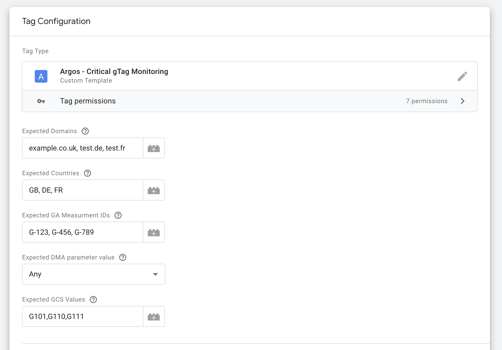
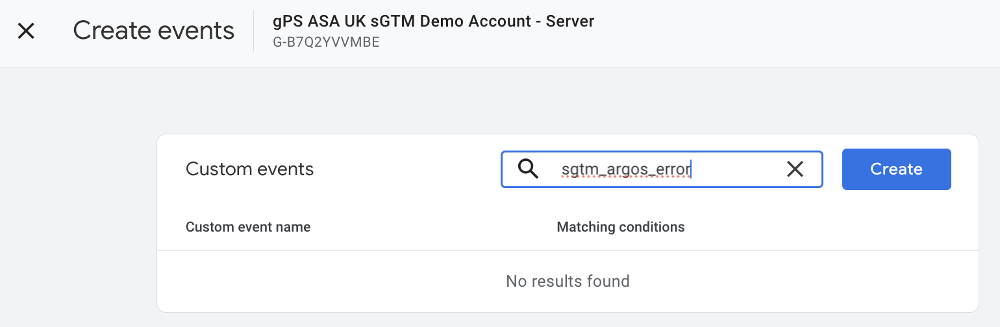
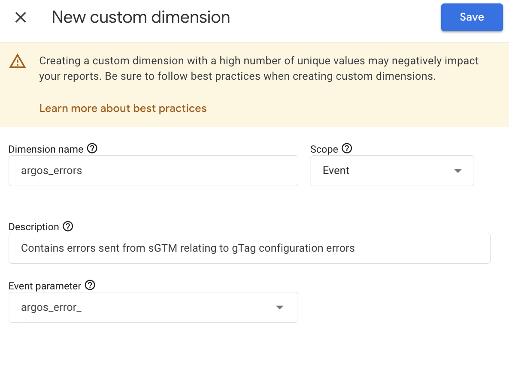
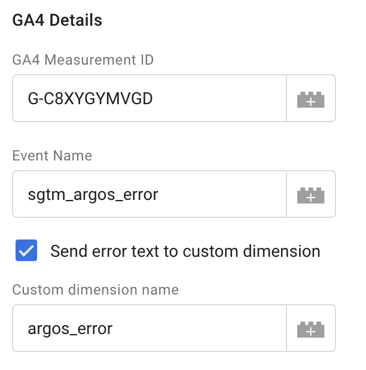
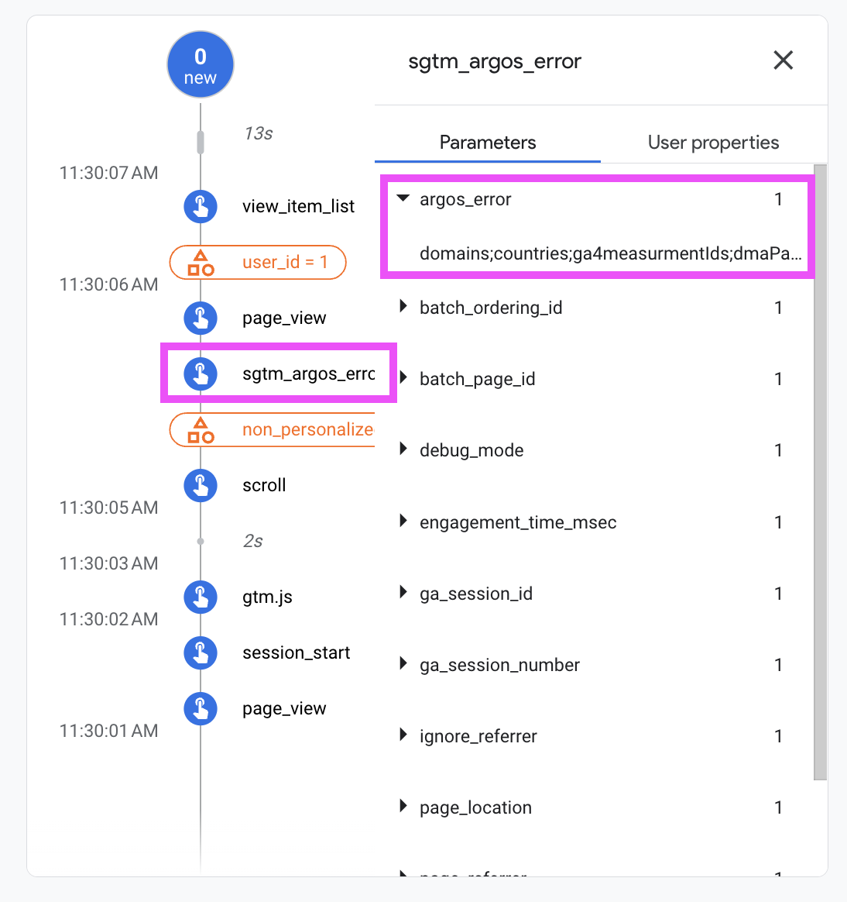
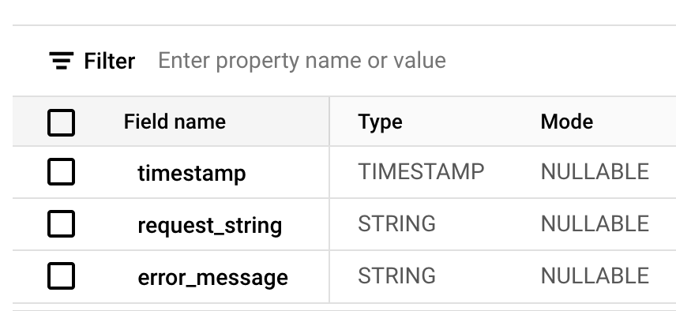
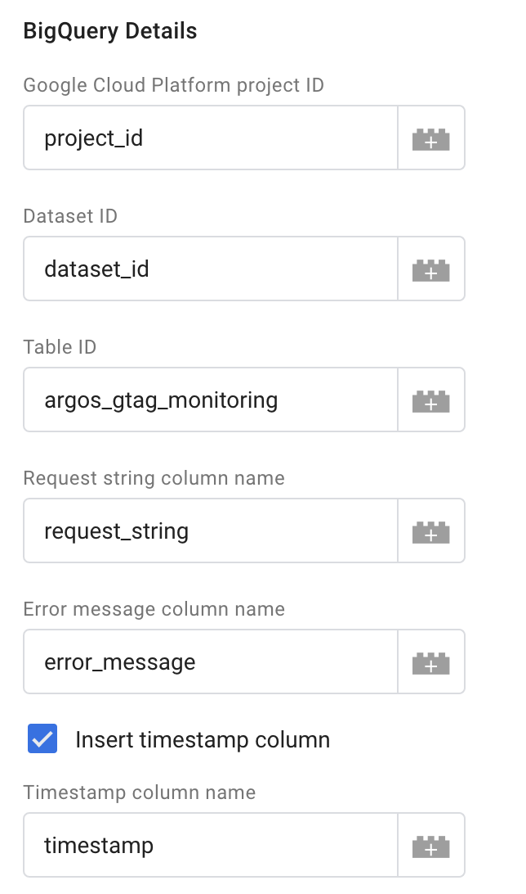
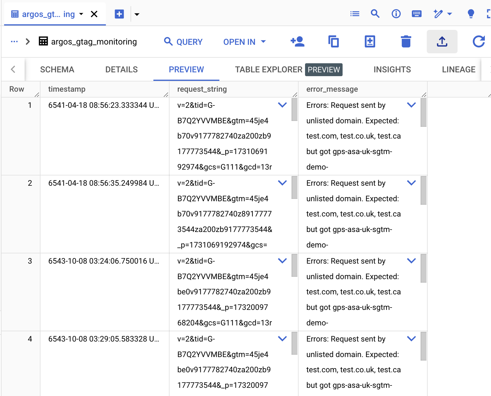
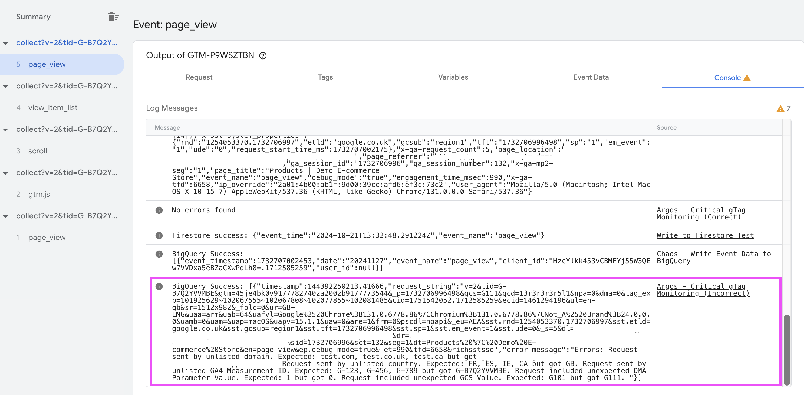

# Argos

Argos checks critical gTag settings and log errors to the console, GA4, and BigQuery

## Background
It is common to encounter problems when moving from client-side tagging to 
server-side tagging because of the many nuaces and complexities involved.
In particular, it is common to find issues with with the Google Tag, or gTag, which can
cause potentially large discrepancies with reporting, bidding, audiences in 
Google and other marketing platforms.

It is often difficult to know what settings and parameters are causing these
issues. Argos monitors a few of the most important settings so any that are incorrect
are spotted quickly. The common configuation settings the tag checks are:

- domain & region settings
- gTag measurement ID
- consent & privacy settings

For more details on these see Explanation of Settings in Detail below.

## Why Argos?

[Argos](https://en.wikipedia.org/wiki/Argus_Panoptes) is a many-eyed, all-seeing
giant in Greek mythology. This tag watches over your gTag settings in production
and allows you to monitor them through GA4, BigQuery, and/or Cloud Logging.

## Implementation
Ready to start implementing this solution? You can follow the guide below which 
outlines how Server Side Google Tag Manager (sGTM) can be used with Firestore, 
to pull in sensitive data and report access it in sGTM variables which can then
be used for the use cases listed above.

### Prerequisites

-   Server Side Google Tag Manager
-   If logging to GA4: admin access to a GA4 Account
-   If logging to BigQuery: read/write access to a BigQuery dataset

### Tag Set-up

1. Download the [crictial_gtag_monitoring.tpl](./crictial_gtag_monitoring.tpl) template to
   your local machine. Make sure the file is saved with the extension `.tpl`.
2. Open [Google Tag Manager](https://tagmanager.google.com) and select your
  server-side container.
3. Click on templates -> the new button in the tag templates section. Click the
   three dots in the top right hand corner and press import.
4. Select the template from your machine.
5. Optionally edit the permissions to specific which projects and tables in BigQuery
   and tags using this template will be able to access. You can use an * if you would 
   like the template to be able to access any database, though you will
   need to ensure access settings are configured correctly (see below).
6. Press save.
7. Go to the tags page and press new.
8. Configure the tag by adding expected settings. For an explanation of each setting 
   see the next section.
9. Choose what actions you'd like the tag to take. If selecting the GA4, BigQuery, or
   Cloud Logging actions follow the additional instructions below to set these up.
10. Add a triggering condition. We recommend firing on all pages or all events while
    doing testing to make sure you catch all potential errors.
11. Save

### Explanation of Settings in Detail

|Setting|What is it?|What will happen if this is incorrect|Example Input|
|---|---|---|---|
|Expected Domains|A comma-separate list of the domains on which your gTag is installed.|If the gTag is called from an incorrect domain it's very likely that attribution will not work correctly because cookies are not shared across domains. [sGTM should always be called from the same domain (including subdomains) as the client-side container](https://developers.google.com/tag-platform/tag-manager/server-side/custom-domain?option=subdomain)|example.co.uk, example.de, example.fr|
|Expected Countries|A list of countries where you expect traffic to|Google treats data differently in different regions. If traffic is coming from unexpected regions it could suggest issues with the client-side gTag set-up or your [region-specific settings](https://developers.google.com/tag-platform/tag-manager/server-side/enable-region-specific-settings) in sGTM. This list should be a comma-searated list of [ISO-3166-1 alpha-2 formatted country codes](https://en.wikipedia.org/wiki/ISO_3166-1_alpha-2)|GB, DE, FR|
|Expected GA Measurment IDs|Comma-separated list of the GA Measurement IDs you expect to see firing on your site.|Having the incorrect GA4 measurement IDs may mean data is routed incorrectly or you have unexpected tags on your website.|G-B7Q2YVVMBE, G-H6334KDAH|
|Expected DMA parameter value|The gTag sets the DMA parameter based on where it thinks the user is. DMA = 1 is expected for EEA traffic and 0 for non-EEA traffic. Different data controls are applied to EEA traffic.|If you are seeing DMA = 1 coming from non-EEA countries you will likely find significant data discrepancies in your Google account because user data will not be joined as expected|Choose 1, 0, or both from the dropdown|
|Expected GCS Values|The [GCS parameter relates to consent mode](https://developers.google.com/tag-platform/security/concepts/consent-mode#:~:text=The%20gcs%20parameter%20is%20used,or%20device%20identifiers%20(app).). G111 means all consent is granted and G100 means all consent is denied but cookieless pings have been implemented. Comma-separated list of the GCS values you expect to see from your tag. Allowed values are: G100, G101, G110, and G111|Seeing unexpected GCS parameters means consent mode is implemented incorrectly.|For basic consent mode you may add: G101,G110, G111. For advanced consent mode you may add G100, G101, G110, G111.|

Here is an example of how you may configure the tag. It is expect traffic from 
three websites in GB, DE, and FR with three gTags. DMA is set to "Any" because
traffic is expected from both inside and outside the EEA. The expected GCS paramters
don't include G100 which means we should not be seeing pings when consent is denied.

### GA4 Setup

If you have selected "Send error event to GA4" follow these additional instructions.

In GA4 you will need set up this event and custom dimesion:

1. Go to your GA4 property > admin > data display > events
2. Create a new event e.g. "sgtm_argos_error"
3. If using the custom dimesion go to admin > data display > custom dimensions
4. Create a custom dimension e.g. "argos_error"

When selected you will see additional inputs appear in the tag template:

1. Add the measurment ID for the GA4 account where you want to send the data
2. Add a name for the event which you set up above
3. Choose if you want to also send the error message as a custom dimension. If you
   do, add the name of the custom dimension you set up above
4. Save or continuing configuring the tag with other settings.

You can check the event is working by launching preview mode in sGTM and triggering
the tag with incorrect settings. In GA4 Debug you should see an event appear as 
shown below:

### BigQuery Setup

If the server-side container is deployed to App Engine or Cloud Run, then Google 
Tag Manager will use the service account attached to the instance for connecting 
to BigQuery.

If the server-side container is deployed in a different Cloud provider to Google 
Cloud, please follow these [additional instructions](https://developers.google.com/tag-platform/tag-manager/server-side/manual-setup-guide#optional_include_google_cloud_credentials) to attach
a Google Cloud service account to the deployment.

This service account needs to have permission to access the BigQuery data.

1. Open the [IAM Service Accounts page](
   https://console.cloud.google.com/iam-admin/serviceaccounts) in the Google
   project that contains the sGTM container and find the account used for the sGTM deployment
   in Cloud Run.
2. Click the pencil to edit the permissions and assign the `BigQuery Data Editor` role ([docs](
   https://cloud.google.com/iam/docs/understanding-roles#bigquery.dataEditor)).
3. Go to [BigQuery](https://pantheon.corp.google.com/bigquery).
4. Within the relevant project create a new dataset, taking note of the name you use.
5. Within the dataset, create a new table again taking note of the name you use.
6. Create a table with two columns for the following: request string, and error 
   message. The type for both should be strings. It doesn't matter what the columns are
   called.
6. Optionally add a timestamp column if you'd like one for easier troubleshooting. The
   type should be timestamp. Again, the name doesn't matter.
6. Save.

Once the BigQuery setup is complete you can add relevant settings in the tag:

1. In the tag tick "Log error to BigQuery". A new section with additional inputs will
   appear below
2. Add the settings for the cloud project, dataset ID and table ID
3. Add the column names for each of the columns making sure they exactly match what
   you created above. If adding a timestamp tick "Insert timestamp column" and add
   the column name in the input that appears
4. Save or continuing configuring the tag with other settings.

You can check the event is working by launching preview mode in sGTM and triggering
the tag with incorrect settings. In BigQuery you should see events logged. You will
also see success or error messages logger in sGTM preview mode.

### Google Cloud Logging Setup

By default sGTM logs to Cloud Logging unless [logging has been disabled](https://developers.google.com/tag-platform/tag-manager/server-side/cloud-run-setup-guide?provisioning=manual#console-logging).
Logging must be enabled for this feature to work.

By ticking "Log request and error to Cloud Logging", the tag will log the request
and error to the console and preppend a custom message to the beginning to allow 
you to filter logs accordingly. Add this message in the Custom Cloud Logging Message
input field

Follow the [console logging instructions](https://developers.google.com/tag-platform/tag-manager/server-side/cloud-run-setup-guide?provisioning=manual#optional_disable_logging)
to filter out the logs coming from the Argos tag using the custom message you've set up.

Note: logging all events can be very expensive, especially for servers with a 
significant amount of traffic. It is possible to choose to only log specific 
messages by following the instructions linked in the previous paragraph.

Note: this will mean that the tag logs twice in preview mode if you have also
selected "Log to console in preview mode when there is an error".

## Disclaimer

Copyright 2024 Google LLC. This solution, including any related sample code or
data, is made available on an “as is,” “as available,” and “with all faults”
basis, solely for illustrative purposes, and without warranty or representation
of any kind. This solution is experimental, unsupported and provided solely for
your convenience. Your use of it is subject to your agreements with Google, as
applicable, and may constitute a beta feature as defined under those agreements.
To the extent that you make any data available to Google in connection with your
use of the solution, you represent and warrant that you have all necessary and
appropriate rights, consents and permissions to permit Google to use and process
that data. By using any portion of this solution, you acknowledge, assume and
accept all risks, known and unknown, associated with its usage, including with
respect to your deployment of any portion of this solution in your systems, or
usage in connection with your business, if at all.
