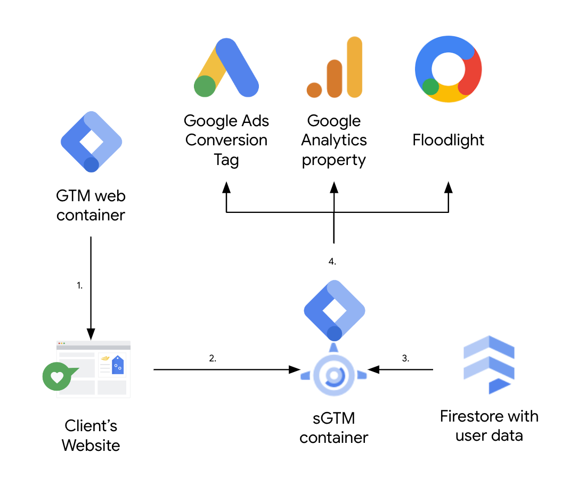
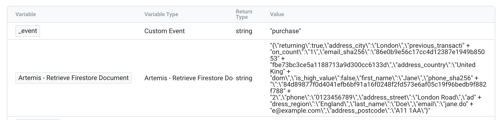
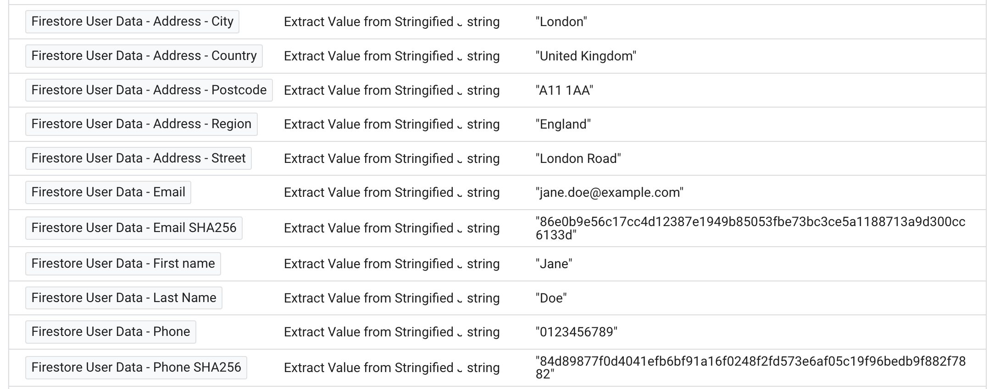
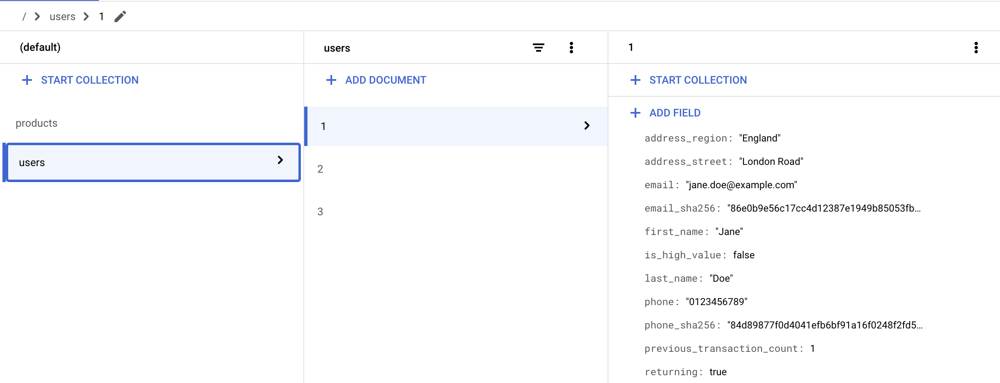
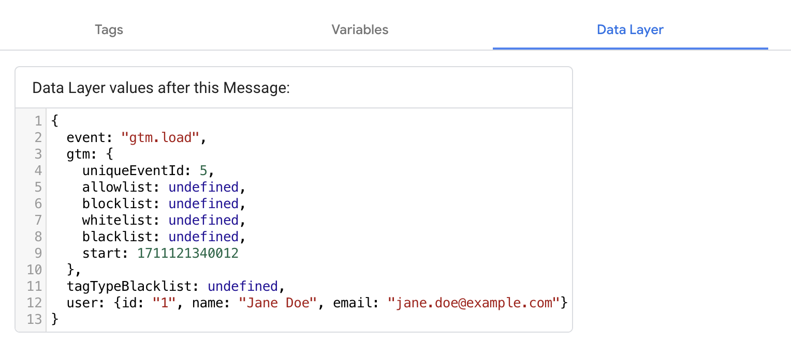
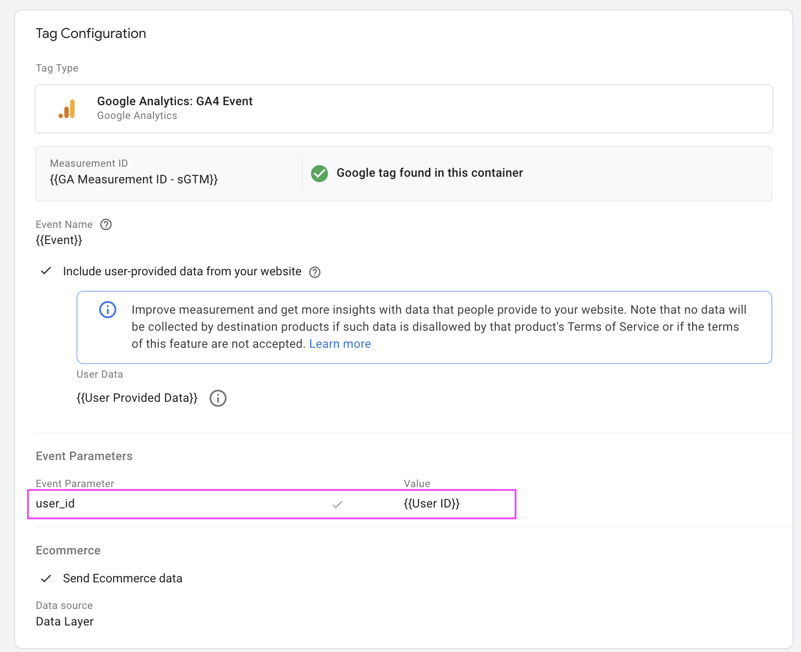
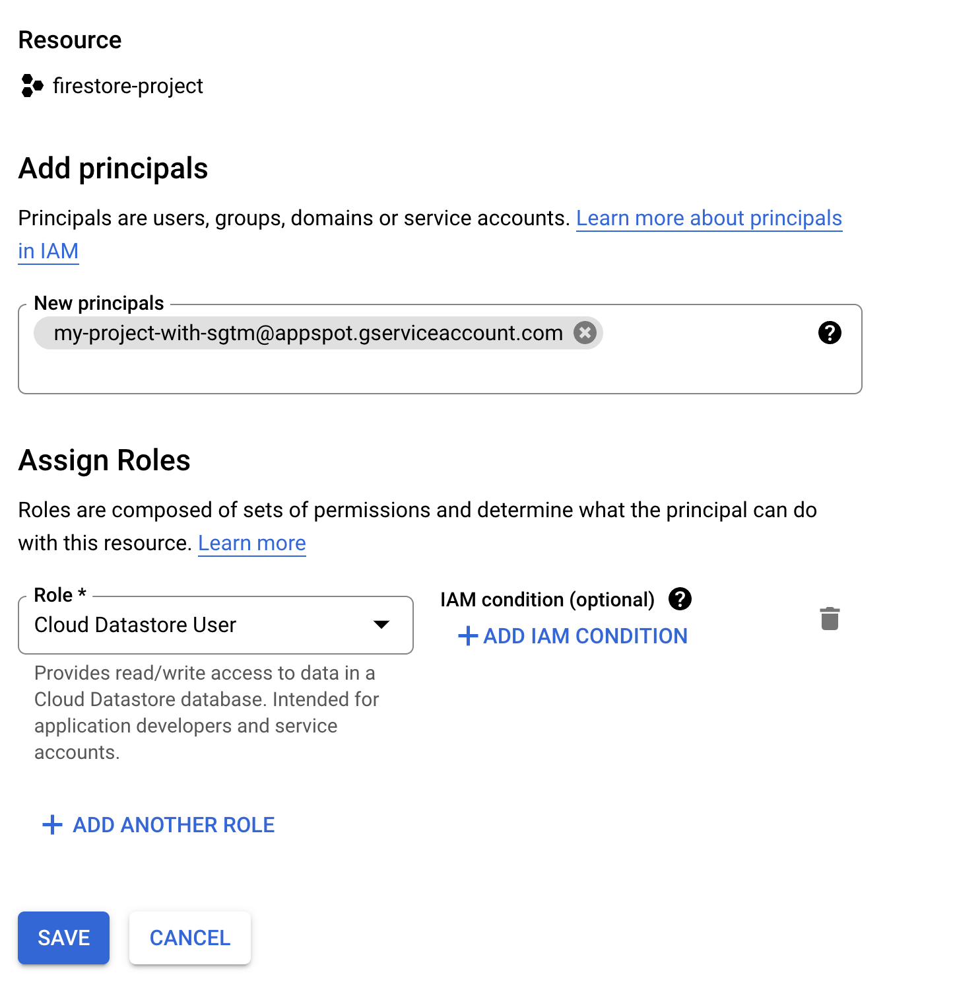

# Artemis

Get documentes from [GCP Firestore](https://firebase.google.com/docs/firestore) 
databases in real time for advanced tag firing, value bidding, audience creation, 
and onsite personalisation while keeping sensitive data away from determined end 
users and third parties.

Use [Server Side Google Tag Manager (sGTM)](
https://developers.google.com/tag-platform/tag-manager/server-side) with
[Firestore](https://cloud.google.com/firestore), to pull in cloud-based and
potentially sensitive data. This enables multiple use cases:

- Conditional tag firing e.g. for new and returning customers even when 
guest checkout has been used
- Supplementing onsite data with customer data from cloud, e.g. segmentation 
groups, previous purchase history, and much more
- Generating advanced bidding metrics in conjunction with [Soteria]
(https://github.com/google-marketing-solutions/gps_soteria) and [Phoebe]
(https://github.com/google-marketing-solutions/gps-phoebe).
- Realtime on-site personalisation enabled by passing data back to the browser
using sGTM's advanced tag behaviour

For examples of how to set-up sGTM for these use cases see [XXX BELOW](kahaksjhdkasjhdaksdhaksjhdkasjdhkasjd).

> Tip 💡: Check out [the sGTM Pantheon](
    https://github.com/google-marketing-solutions/gps-sgtm-pantheon/tree/main)
for more tags for different use-cases.

## Background
First party data is becoming ever more important to digital marketing. Marketers
who are able to effectively use the insights and knowledge they have about their
customers have an advantage over those who do not use this data. Accessing data
about customers that is not immediatly available on the website is usually
difficult though and requires significant web development and involves exposing 
data on the website. This means many digital marketing teams do not make use of 
the extensive data their BI teams have on their customers

This data is sensitive, therefore most clients would not like a determined user 
to be able to access this information. As a result, clients will tend to either 
use a proxy value in its place or implement a batch upload strategy using one of 
the Google APIs. The former complicates reporting and some clients are uncomfortable 
with this approach. The latter poses issues due to the lack of support for 
conversion modelling, and some worry about the impact on bidding, caused by the 
delay in reporting the conversions in batches.

sGTM has feature parity for modelling with the client side JavaScript tag, it
happens in real time, and enables pulling in external "sensitive" data, so it
operates in the sweet spot between the two existing approaches.

## Why Artemis?

[Artemis](https://en.wikipedia.org/wiki/Artemis) is the Greek goddess of the hunt. 
Like the goddess, the solution goes out hunting for data and returns with it.

## Implementation
Ready to start implementing this solution? You can follow the guide below which 
outlines how Server Side Google Tag Manager (sGTM) can be used with Firestore, 
to pull in sensitive data and report access it in sGTM variables which can then
be used for the uses cases listed above.

## Prerequisites

-   Server Side Google Tag Manager
-   Access to a Google Cloud project with Firestore in
    [Native mode](https://cloud.google.com/datastore/docs/firestore-or-datastore)
-   Access to user data keyed by a user ID available within the dataLayer of
your website

## Architecture

[Image 1](#image-1) provides a high level overview of the core components
involved, and outlines the flow. This is high level, please see
[solution details](#solution-details) for further information.

##### *Image 1*

 

1.  A GTM web container is used to set up tagging on the site, and is configured
    with a dataLayer event ([more details on gTag events]
    (https://developers.google.com/tag-platform/tag-manager/datalayer#use_a_data_layer_with_event_handlers)).
2.  The client’s website is set up to include a user ID in the dataLayer: this
    will be used as a key to access data in Firestore. The user ID could be
    an email address (hashed or unhashed) or any other kind of ID which is
    available on the website, offline, and in the cloud.
3.  When sGTM recieve the event, it will look up the data in Firestore and return
    an entire Firestore document in the form of a stringified JSON object. Further
    variables are used to extract and clean this data as required 
4.  The updated event is sent to Google Analytics, Floodlights, or Google Ads.

Below you can see an example Firestore document containing user data returned as a 
Stringified JSON Object as a variable using the Artemis variable template:

And here you can this data has been cleaned up into more useable variables using
another template:

### Firestore

There is a requirement to use Firestore Native, if you've already used Datastore
mode, then you'll have to create a new project and store data for each
user in a Firestore document
([read more](https://cloud.google.com/datastore/docs/firestore-or-datastore)).

The recommended way is to set each Firestore document ID to the user ID, this
way it's easy to fetch the right document by a single lookup.

First create a `users` collection, then add documents to this collection for
each product. These documents should have a field with the profit value.

The Firestore collection name, and document field can be set when setting up the
variable in sGTM.

The image below shows an example of the kind of data you may host for a user 
in Firestore including their user data, whether they're a returning or new
customer, and audiences segments such as "is_high_value"

##### *Image 2*

 

## Client-side GTM

To look up the user data from Firestore, the client-side container must be 
configured to send the required user ID as part of the event you will be
using to trigger the lookup. The user ID can be passed into the gTag in
various ways. 

The image below shows an example where a user object has
been added to the dataLayer:

##### *Image 3*

A variable is then used to extract the user ID:

##### *Image 4*

This user ID variable is added as an event parameter to the relevant event tag
which sends data to the server-side container:

##### *Image 5*

### Server-Side GTM

#### Overview

This is where the magic happens. In the server side container the user data
is looked up using the "[Aretmis variable template](./../src/gtm/get_document_from_firestore.tpl)”.
The document is returned as a Stringified JSON object. Value can be extracted
using the "[extraction template](./../src/gtm/extract_value_from_stringified_json_object.tpl)”.

#### Set up

##### Auth

If the server side container is deployed to App Engine or Cloud Run, then Google
Tag Manager will use the service account attached to the instance for connecting
to Firestore.

If the server side container is deployed in a different Cloud provider to Google
Cloud, please [follow these additional instructions](
https://developers.google.com/tag-platform/tag-manager/server-side/manual-setup-guide#optional_include_google_cloud_credentials)
to attach a Google Cloud service account to the deployment.

This service account needs to have permission to access the Firestore data.

1. Open the [IAM Service Accounts page](
   https://console.cloud.google.com/iam-admin/serviceaccounts) in the Google
   project that contains the sGTM container, and make a note of the service
   account email.
   
2. Open the [IAM page](https://console.cloud.google.com/iam-admin/iam) for the
   Firestore project, and press grant access.
   
3. Add the service account email from step 1, and assign it the `Cloud Datastore
   User` role ([docs](
   https://cloud.google.com/iam/docs/understanding-roles#datastore-roles)).
   

##### Variables in Tag Manager

1. Download the [Aretmis variable template](./../src/gtm/get_document_from_firestore.tpl) 
   and [extraction template](./../src/gtm/extract_value_from_stringified_json_object.tpl) 
   files. Ensure that the file extensions remain .tpl.
2. Go to the server side container in
   [tagmanager.google.com](https://tagmanager.google.com/).
3. Go to templates -> new variable template.
4. Click on the three-dot menu on the top right and choose `Import`.
5. Select the "[Aretmis variable template](./../src/gtm/get_document_from_firestore.tpl)”
    file.
6. Go to the permission tab and set the permissions for Firestore, ensuring you
   update the project ID.
   
7. Save the template.
8. Go to variables -> new user defined variable and create a “user” variable
   from the Artemis variable template. You will need to pass in the use variable
   that is being send from the client-side event which may required you creating 
   a user ID variable depending on your set up.
9. Go to templates -> new variable template.
10. Click on the three-dot menu on the top right and choose `Import`.
11. Select the [extraction template](./../src/gtm/extract_value_from_stringified_json_object.tpl) 
    file.
12. Save the template.
13. Go to variables -> new user defined variable and create variables based on 
    your (e.g. new/returning user, high_value_user) from the extraction variable
    template.
14. These variable are now available to be used in tags as metrics and dimensions
11. Save and deploy the code.

## Example Use-cases

### Conditionally fire tags only for new or returning users

1. In Firestore include a new/returning attribution with the value set to true or false
2. Use Aretemis and the extraction variable templates to create a variable in sGTM to pull in this value
3. Create a trigger which only fires when this variable is true or false

### Only fire tags on second transactions

1. In Firestore include a no. of transactions attribution with the value set to true or false
2. Use Aretemis and the extraction variable templates to create a variable in sGTM to pull in this value
3. Create a trigger which only fires when this variable is > 1. 

### Add audiences to GA4 audience based on segments computed offline

1. In Firestore include attributes related to audience properties (e.g. value deciles) 
2. Use Aretemis and the extraction variable templates to create a variable in sGTM to pull in this value
3. In GA4 create a custom dimension which will be used to filter for this audience segment
4. In sGTM add this custom dimension to the relevant tag, pulling in the variable as the value

### Use data from the website and from firestore

1. Configure variable as described in the documentation above to get data useful for a model 
   hosted in sGTM
2. Use the [Phoebe solution](https://github.com/google/gps-phoebe) to call this model, passing the 
   varibles set up in the first step as fields.

### Update your website in realtime based on audience data hosted in the cloud

1. In Firestore relevant user data which will be used by the site
2. Use Aretemis and the extraction variable templates to create a variable in sGTM to pull in this value
3. Create a [custom tag template](https://developers.google.com/tag-platform/tag-manager/templates) in
   sGTM to write data back to the using the [setCookie method](https://developers.google.com/tag-platform/tag-manager/templates/api#setcookie). 
   Include a field that can accpet the variable.
4. Create a tag using this template and include the variable. Work with your web team to make the page
   responsive based on the values passed into the cookies

## Disclaimer

Copyright 2024 Google LLC. This solution, including any related sample code or
data, is made available on an “as is,” “as available,” and “with all faults”
basis, solely for illustrative purposes, and without warranty or representation
of any kind. This solution is experimental, unsupported and provided solely for
your convenience. Your use of it is subject to your agreements with Google, as
applicable, and may constitute a beta feature as defined under those agreements.
To the extent that you make any data available to Google in connection with your
use of the solution, you represent and warrant that you have all necessary and
appropriate rights, consents and permissions to permit Google to use and process
that data. By using any portion of this solution, you acknowledge, assume and
accept all risks, known and unknown, associated with its usage, including with
respect to your deployment of any portion of this solution in your systems, or
usage in connection with your business, if at all.