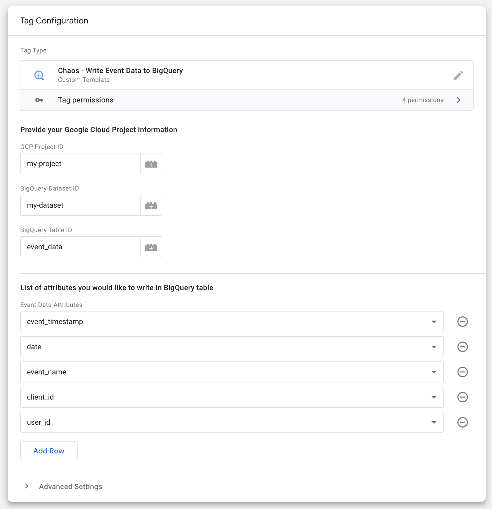
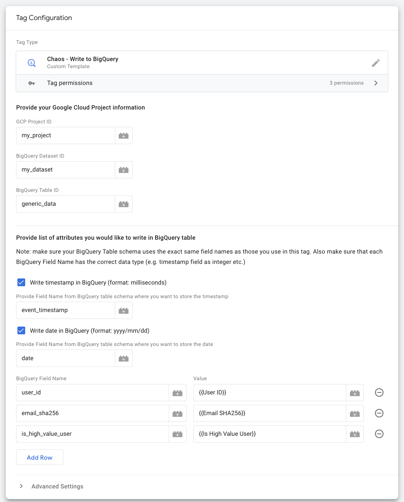

# Chaos

Write data to [BigQuery](https://cloud.google.com/bigquery) to improve first-party 
data collection or for advanced analysis.

## Why Chaos?

In Greek mythology [Chaos](https://en.wikipedia.org/wiki/Chaos_(cosmogony)) is
an infinitely large space which became filled by the world. This tag fills BigQuery,
an essentially infinitely large database, with data.

## Prerequisites

- Server Side Google Tag Manager deployed
- Access to BigQuery (see Auth Setup below for more details)

## Tag Variants

This solution has two tag variants:

- **Write to BigQuery** - this allows you to write any data you have available
  in sGTM to BigQuery including any event data, variables, and data accessed
  via other [sGTM Pantheon](https://github.com/google-marketing-solutions/gps-sgtm-pantheon) 
  solutions. This tag is very flexible though may need some code updates for
  some use cases.
- **Write event data to BigQuery** - a more specific tag which allows you to access
  solely the event data in sGTM. If you only want to use event data this tag
  will be quicker to set up and easier to use because it has been coded
  to pull in the event data automatically with the ability to choose which
  event parameters you pass to BigQuery. 

As both tags are sGTM templates they can be customized if required within sGTM 
by editing the template.

## Auth Setup

If the server-side container is deployed to App Engine or Cloud Run, then Google 
Tag Manager will use the service account attached to the instance for connecting 
to BigQuery.

If the server-side container is deployed in a different Cloud provider to Google 
Cloud, please follow these [additional instructions](https://developers.google.com/tag-platform/tag-manager/server-side/manual-setup-guide#optional_include_google_cloud_credentials) to attach
a Google Cloud service account to the deployment.

This service account needs to have permission to access the BigQuery data.

1. Open the [IAM Service Accounts page](
   https://console.cloud.google.com/iam-admin/serviceaccounts) in the Google
   project that contains the sGTM container and find the account used for the sGTM deployment
   in Cloud Run.
2. Click the pencil to edit the permissions and assign the `BigQuery Data Editor` role ([docs](
   https://cloud.google.com/iam/docs/understanding-roles#bigquery.dataEditor)).

## BigQuery Setup

1. Go to [BigQuery](https://pantheon.corp.google.com/bigquery).
2. Within the relevant project create a new dataset, taking note of the name you use.
3. Within the dataset, create a new table again taking note of the name you use.
4. Configure the table schema based on the data that you will be writing to BigQuery.
   The table schema will need to exactly match the tag configuration to avoid errors.
   For details on the data types for event parameters see the table below. If using
   other variables in sGTM ensure that the data format will work based on the variable
   settings you have configured in sGTM. Set columns to nullable to ensure that missing
   data does not cause no data to be written. Note: columns may be added at late but
   not deleted.
5. Configure other table settings as required.
6. Save.

## sGTM Setup

1. Download the [write_to_bigquery.tpl](./write_to_bigquery.tpl) and/or the
   [write_event_data_to_bigquery.tpl](write_event_data_to_bigquery.tpl) template to
   your local machine. Make sure the file is saved with the extension `.tpl`.
2. Open [Google Tag Manager](https://tagmanager.google.com) and select your
  server-side container.
3. Click on templates -> the new button in the tag templates section. Click the
   three dots in the top right hand corner and press import.
4. Select the template from your machine.
5. Optionally edit the permissions to specific which projects and tables in BigQuery
   and tags using this template will be able to access. You can use an * if you would 
   like the template to be able to access any database, though you will
   need to ensure access settings are configured correctly (see below).
6. Press save.
7. Go to the tags page and press new.
8. Under tag configuration select either Chaos - Write Event Data to BigQuery or 
   Chaos - Write to BigQuery. In the project, data view, and table IDs you created earlier
   - a. Chaos - Write Event Data to BigQuery. You can use the tick boxes to choose to
     automatically add the event time (ms) and date to your table. Below add a list of values
     which you want the tag to write to BigQuery. The field name should exactly match the 
     column name in the BigQuery table and the value needs to be in the correct format to avoid
     errors during execution.
   - b. Chaos - Write Event Data to BigQuery. Use the drop downs to select which event parameters
     you want the tag to write. For this tag the column name in BigQuery must exactly match the
     values in the dropdowns to avoid errors during execution.
9. Add a trigger, and preview/submit your code. 

Here is an example configuration for the event data tag:

And here is an example of the generic tag which is writing the user ID taken from
the event as well as other data from other variables in sGTM:

## sGTM Event Data BigQuery Format

The table below shows the data formats for the standard event parameters in sGTM 
when using a GA4 client:

| Event Parameter | Format |
|---|---|
| event_timestamp | INTEGER |
| date | STRING |
| event_name | STRING |
| ga_session_id | STRING |
| ga_session_number | INTEGER |
| client_id | STRING |
| user_id | STRING |
| user_agent | STRING |
| ip_address | STRING |
| event_location_country | STRING |
| event_location_region | STRING |
| page_location | STRING |
| page_title | STRING |
| page_referrer | STRING |
| language | STRING |
| screen_resolution | STRING |
| value | FLOAT |
| currency | STRING |
| transaction_id | STRING |
| x_ga_dma | STRING |
| x_ga_dma_cps | STRING |
| x_ga_gcd | STRING |
| x_ga_gcs | STRING |
| x_ga_npa | STRING |
| x_ga_measurement_id | STRING |
| x_ga_page_id | STRING |
| ga_debug_mode | STRING |

## Disclaimer
__This is not an officially supported Google product.__

Copyright 2024 Google LLC. This solution, including any related sample code or
data, is made available on an "as is", "as available", and "with all faults"
basis, solely for illustrative purposes, and without warranty or representation
of any kind. This solution is experimental, unsupported and provided solely for
your convenience. Your use of it is subject to your agreements with Google, as
applicable, and may constitute a beta feature as defined under those agreements.
To the extent that you make any data available to Google in connection with your
use of the solution, you represent and warrant that you have all necessary and
appropriate rights, consents and permissions to permit Google to use and process
that data. By using any portion of this solution, you acknowledge, assume and
accept all risks, known and unknown, associated with its usage, including with
respect to your deployment of any portion of this solution in your systems, or
usage in connection with your business, if at all.
