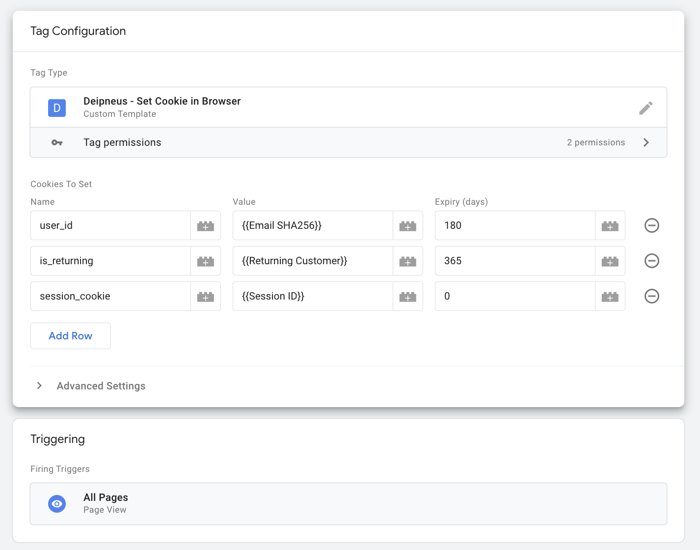

# Deipneus

Send data from Server-side Google Tag Manager back to the website using durable 
first-party cookies for real-time website personalization.

## Why Deipneus?

[Deipneus](https://en.wikipedia.org/wiki/Deipneus) is the Greek God of food, in 
particular bread. (It's the closest God we could find who had even a tangential 
connection to cookies!)

Deipneus is pronounced a bit like "deep-KNEE-uss".

## Prerequisites

- sGTM deployed

## Get Started

1. Download a copy of the [set_cookie_in_browser.tpl](./set_cookie_in_browser.tpl) to
  your local machine. Make sure the file is saved with the extension `.tpl`.
2. Open [Google Tag Manager](https://tagmanager.google.com) and select your
  server-side container.
3. Click on templates -> the new button in the tag templates section. Click the
   three dots in the top right hand corner and press import.
4. Select the set_cookie_in_browser.tpl from your machine. 
5. Optionally update the permissions for the cookies that the tag is allowed
   to set by going to permissions > sets a cookie. Use * to allow the tag to
   set any cookies. If you want to set a session cookie set the expiry (days)
   to 0.
6. Press save.
7. Go to the tags page and press new.
8. Under tag configuration select Deipneus - Set Cookie in Browser.
9. Add a row for each cookie you want to set in the browser by hard-coding
   the values or using variables already configured in sGTM.
10. Add a trigger, and preview/submit your code.
11. You can check the cookies have been set correctly by using browser dev
    tools.

Here is an example configuration:

## Disclaimer
__This is not an officially supported Google product.__

Copyright 2024 Google LLC. This solution, including any related sample code or
data, is made available on an "as is", "as available", and "with all faults"
basis, solely for illustrative purposes, and without warranty or representation
of any kind. This solution is experimental, unsupported and provided solely for
your convenience. Your use of it is subject to your agreements with Google, as
applicable, and may constitute a beta feature as defined under those agreements.
To the extent that you make any data available to Google in connection with your
use of the solution, you represent and warrant that you have all necessary and
appropriate rights, consents and permissions to permit Google to use and process
that data. By using any portion of this solution, you acknowledge, assume and
accept all risks, known and unknown, associated with its usage, including with
respect to your deployment of any portion of this solution in your systems, or
usage in connection with your business, if at all.
