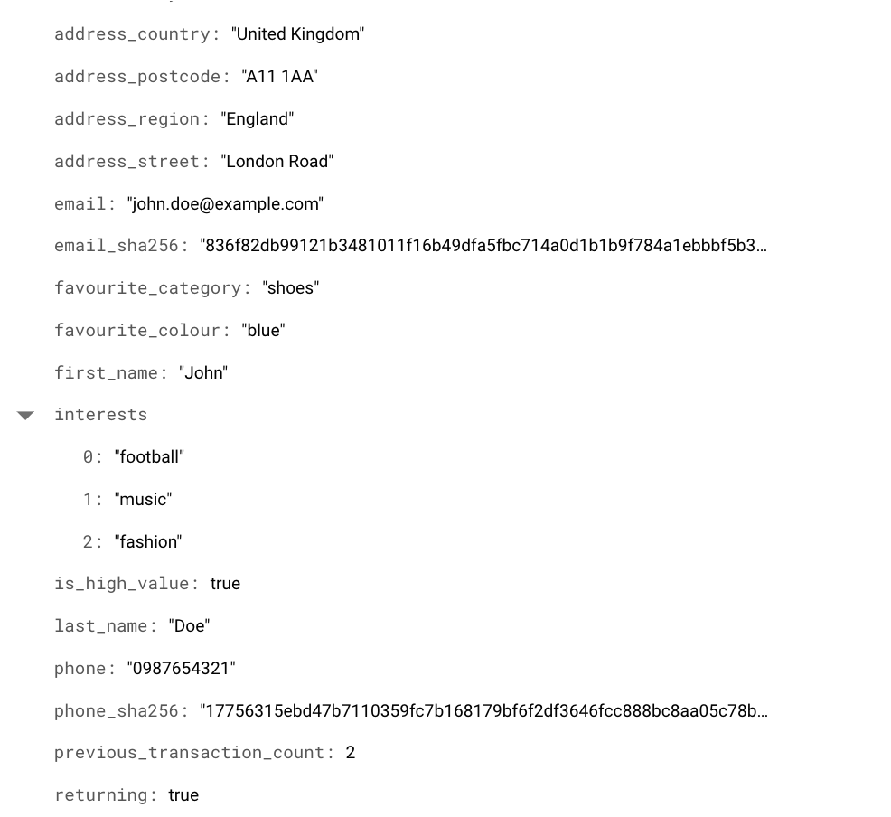
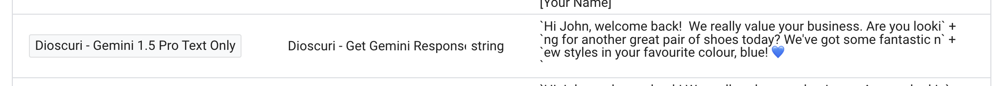

# Dioscuri

Get response from [Google Gemini 1.0 Pro and 1.5 Pro](https://cloud.google.com/vertex-ai/generative-ai/docs/model-reference/gemini) 
in real time. This solution is useful for getting quick access to Gemini
using sGTM, which enables a light-weight set-up and an easy integration
with you website, cloud infrastucture, and third-party platforms.

## Why Dioscuri?

The [Dioscuri](https://en.wikipedia.org/wiki/Castor_and_Pollux) is the name 
given to twin brothers Castor and Pollux. In Latin they are known as the Gemini.

## Implementation
Ready to start implementing this solution? You can follow the guide below which 
outlines how Server Side Google Tag Manager (sGTM) can be used with Gemini.

## Prerequisites

-   Server Side Google Tag Manager
-   Access to a Google Cloud project with billing enabled

## Vertex AI API Setup

1. In the Google Cloud console, on the project selector page, select a 
   Google Cloud project.
2. [Use this link to enable the Vertex AI API](https://console.cloud.google.com/apis/enableflow?apiid=aiplatform.googleapis.com)
3. Go to IAM settings and find the service account which is used to deploy sGTM.
   Grant this service account the Vertex AI User permission.

More details can be found on this [quickstart guide](https://cloud.google.com/vertex-ai/generative-ai/docs/start/quickstarts/quickstart-multimodal)

## Server-Side GTM Setup

1. Download the [Dioscuri variable template](./dioscuri_get_gemini_response.tpl) 
2. Go to the server-side container in
   [tagmanager.google.com](https://tagmanager.google.com/).
3. Go to templates -> new variable template.
4. Click on the three-dot menu on the top right and choose `Import` and choose
   the file you've just downloaded
5. Save the template.
6. Go to variables -> new user defined variable and create a “user” variable
   from the Dioscuri variable template and fill in the template.
   - a. Enter the project ID where you have enabled the Vertex AI API
   - b. Enter the cloud region. As of June 2024 the only available region 
        is us-central1
   - c. Choose a model. Gemini 1.0 Pro is not able to accept files as prompts 
        and has fewer settings. Available settigs are automatically shown or 
        hidden depending on your selection
   - d. Add text prompts. You can add as many as you like. You can include data 
        from other variables
   - e. If using Gemini 1.5 Pro you can include file prompts. Upload files to 
        cloud storage and get their Google Cloud file path which will start with
        gs://. Ensure you select the correct file type. Any file types not listed
        are not available. See [documentation](https://cloud.google.com/vertex-ai/generative-ai/docs/model-reference/gemini)
        for specific requirements and limitations 
   - f. Add a system instruction. This is a powerful statement to direct the 
        response e.g. "Keep response as short and friendly as possible"
   - g. Add a default value which will be returned if the tag fails. You can include
        other Google Tag Manager variables in this field.
   - h. Choose your safety settings. Be aware tighter settings may cause the response
        to fail more often depending on your prompts.
   - i. Update the generation configuation settings if required. These can be used
        to tweak the response length and other elements. See below for more details
        on what each setting can be used for
   - j. Save
7. Use the variable in a tag which has a live trigger and you will see data returned

## Example Use Case

You are a retail client who wants to get a personalised message for a user when
they log into your site. You have already got user data in Firestore and it is
accessible in sGTM as variables using [Artemis](./sgtm/artemis/README.md).

Add some text prompts. In this example we added the following:

1. You are a virtual salesperson for a retail company which sells clothes. Write 
a greeting for {{Firestore User Data - First name}} and suggest the kinds of products 
they might want to look at today. It is {{Returning Customer - boolean}} that she is
a returning customer and it is {{Is High Value User - boolean}} that she is a high value 
customers. They live in {{Firestore User Data - Address - City}}, {{Firestore User Data - 
Address - Country}}.
2. Here is some information about {{Firestore User Data - First name}} in a stringified 
JSON format which you should parse: {{Customer Data}}
3. For high-value customers make sure to say how much you value them. For low value 
customers encourage them to buy more

Variables in braces are automatically replaced with relevant values based on customer
data in real time. For example this is the customer data held for a customer, John,
in Firestore

When we run the tag you can see Gemini returns a personalised response which is 
aware of his favourte category and colour:

## Explanation of Settings

|Setting|Explanation|
|---|---|
|Temperature|Controls the degree of randomness in token selection during response generation. Lower values produce more focused responses, while higher values lead to more diverse or creative results. A temperature of 0 selects the most probable tokens, resulting in deterministic responses.   Ranges: gemini-1.5-pro (0.0 - 2.0, default: 1.0), gemini-1.0-pro-vision (0.0 - 1.0, default: 0.4), gemini-1.0-pro-002 (0.0 - 2.0, default: 1.0), gemini-1.0-pro-001 (0.0 - 1.0, default: 0.9)|
|maxOutputTokens|The maximum number of tokens allowed in the response. A token is roughly four characters. 100 tokens are approximately 60-80 words.   Ranges: gemini-1.5-pro (1-8192, default: 8192), gemini-1.0-pro (1-8192, default: 8192), gemini-1.0-pro-vision (1-2048, default: 2048)|
|topP	Influences|token selection by sampling from most to least probable until the sum of probabilities equals the top-P value. Lower values produce less random responses, higher values more random ones.   Defaults: gemini-1.5-pro (0.94), gemini-1.0-pro (1), gemini-1.0-pro-vision (1)|
|frequencyPenalty|Positive values penalize the repetition of tokens in the generated text, encouraging more diverse output. Range: -2.0 to 2.0 (excluding 2.0)|
|presencePenalty|Positive values penalize tokens already present in the generated text, promoting the generation of more diverse content. Range: -2.0 to 2.0 (excluding 2.0)|
|candidateCount|The number of response variations to return. This value must be 1.|
|stopSequences|A list of case-sensitive strings. If the model encounters one of these strings in the response, it stops generating text. Maximum 5 items.|

A full list of API parameters and their descriptions can be found in the [developer documentation](https://cloud.google.com/vertex-ai/generative-ai/docs/model-reference/gemini).

## Disclaimer

Copyright 2024 Google LLC. This solution, including any related sample code or
data, is made available on an “as is,” “as available,” and “with all faults”
basis, solely for illustrative purposes, and without warranty or representation
of any kind. This solution is experimental, unsupported and provided solely for
your convenience. Your use of it is subject to your agreements with Google, as
applicable, and may constitute a beta feature as defined under those agreements.
To the extent that you make any data available to Google in connection with your
use of the solution, you represent and warrant that you have all necessary and
appropriate rights, consents and permissions to permit Google to use and process
that data. By using any portion of this solution, you acknowledge, assume and
accept all risks, known and unknown, associated with its usage, including with
respect to your deployment of any portion of this solution in your systems, or
usage in connection with your business, if at all.
