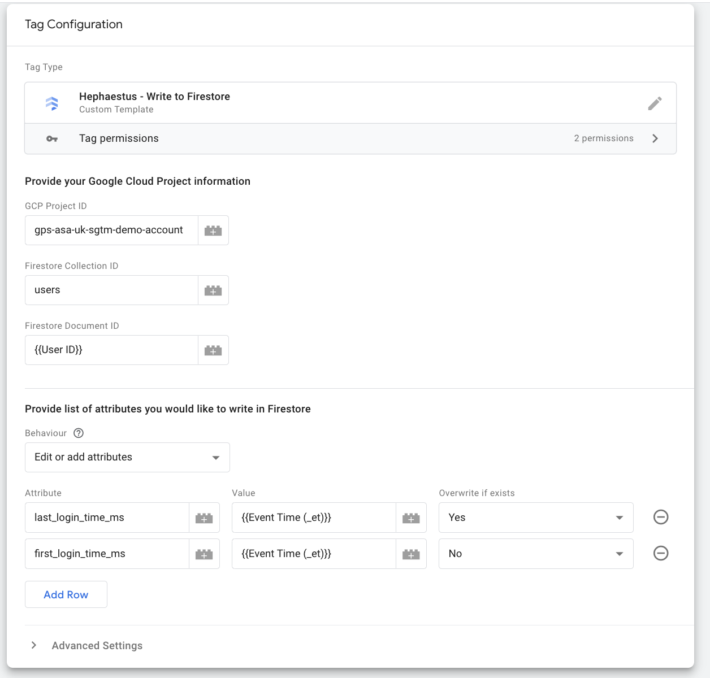
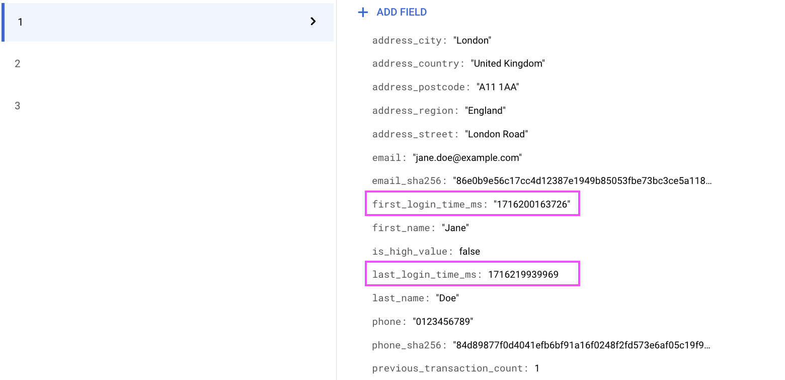
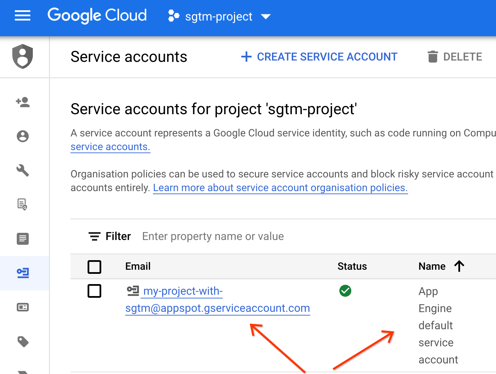
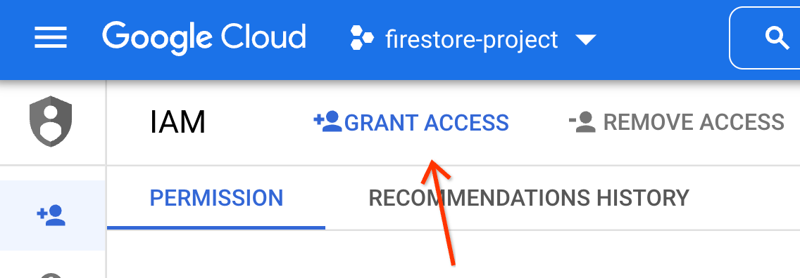

# Hephaestus

Write data from Server-side Google Tag Manager (sGTM) to Google Cloud
[Firestore](https://cloud.google.com/firestore).

## Why Hephaestus?

[Hephaestus](https://en.wikipedia.org/wiki/Hephaestus) is the God of Fire. He used 
the fire of the forge as a creative force.

Hephaestus is pronounced "hef-FI-stuss"

## Prerequisites

- Server Side Google Tag Manager deployed
- Access to a Google Cloud project with Firestore in Native mode
- A collection in Firestore where the document ID is a value which is avaiable
  as a variable in sGTM

## Get Started

1. Download a copy of the [write_to_firestore.tpl](./write_to_firestore.tpl) to
  your local machine. Make sure the file is saved with the extension `.tpl`.
2. Open [Google Tag Manager](https://tagmanager.google.com) and select your
  server-side container.
3. Click on templates -> the new button in the tag templates section
. Click the three dots in the top right hand corner and press import.
4. Select the write_to_firestore.tpl from your machine.
5. Optionally, under permissions add the GCP Project ID under Project ID and the Firestore
   collection name under path. You can use an * if you would like the template
   to be able to access multiple projects and/or collections, though you will
   need to ensure access settings are configured correctly (see below).
6. Press save.
7. Go to the tags page and press new.
8. Under tag configuration select Hephaestus - Write to Firestore.
9. Enter the GCP Project ID, collection name, and document ID. The document ID
   field will likely need to use a variable such as user ID, session ID, product 
   ID which will be used to access the relevant document in Firestore dynamically
10. Choose the tag behaviour you want:
  - a. Replace Entire Document - this will instruct the tag to delete the entire 
  contents of the documents in Firestore and replace it with the attributes listed
  in the tag
  - b. Edit or add attributes - this gives you the ability to edit or add individual 
  attributes within a document without affecting any other attributes that may be in 
  Firestore. With this second option you can choose for each attribute the behaviour
  if this attribute already exists. If you would like to overwrite the attribute select
  "Yes" for overwrite if exists. If you select "no" instead the tag will not edit the
  attribute if it already exists in Firestore. If you select "no" and the attribute
  does not yet exist it will create the attribute and set the relevant value on the
  first fire but will not edit it on future tag fires.
11. Add a trigger, and preview/submit your code.

Here is an example configuration with the edit or add attribute behaviour selected:

This tag use a login trigger so will write the event time to the last_login_time_ms
attribute in Firestore every time a user logs in. If the first_login_time_ms already 
exits it will leave it unchanged, but if it does not exist it will write it.

## Auth Setup

If the server side container is deployed to App Engine or Cloud Run, then Google 
Tag Manager will use the service account attached to the instance for connecting 
to Firestore.

If the server side container is deployed in a different Cloud provider to Google 
Cloud, please follow these [additional instructions](https://developers.google.com/tag-platform/tag-manager/server-side/manual-setup-guide#optional_include_google_cloud_credentials) to attach
a Google Cloud service account to the deployment.

This service account needs to have permission to access the Firestore data.

1. Open the [IAM Service Accounts page](
   https://console.cloud.google.com/iam-admin/serviceaccounts) in the Google
   project that contains the sGTM container, and make a note of the service
   account email.
   
2. Open the [IAM page](https://console.cloud.google.com/iam-admin/iam) for the
   Firestore project, and press grant access.
   
3. Add the service account email from step 1, and assign it the `Cloud Datastore
   User` role ([docs](
   https://cloud.google.com/iam/docs/understanding-roles#datastore-roles)).
   

## Disclaimer
__This is not an officially supported Google product.__

Copyright 2024 Google LLC. This solution, including any related sample code or
data, is made available on an "as is", "as available", and "with all faults"
basis, solely for illustrative purposes, and without warranty or representation
of any kind. This solution is experimental, unsupported and provided solely for
your convenience. Your use of it is subject to your agreements with Google, as
applicable, and may constitute a beta feature as defined under those agreements.
To the extent that you make any data available to Google in connection with your
use of the solution, you represent and warrant that you have all necessary and
appropriate rights, consents and permissions to permit Google to use and process
that data. By using any portion of this solution, you acknowledge, assume and
accept all risks, known and unknown, associated with its usage, including with
respect to your deployment of any portion of this solution in your systems, or
usage in connection with your business, if at all.
