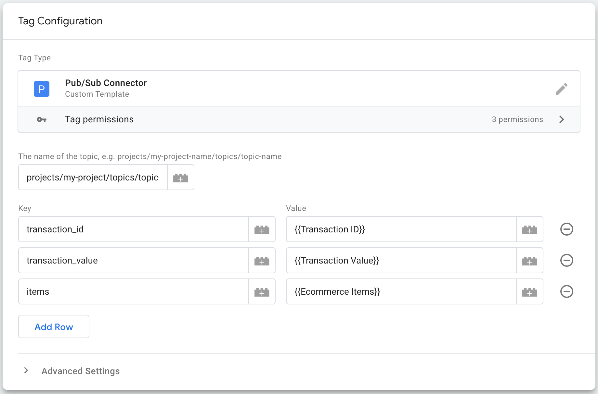

# Hermes

Send event data from Server-side Google Tag Manager (sGTM) to Google Cloud
[Pub/Sub](https://cloud.google.com/pubsub/docs/overview).

## Why Hermes?

[Hermes](https://en.wikipedia.org/wiki/Hermes) was the messenger God of Greek
mythology, and like the god, this solution allows you to send messages between
your divine worlds of tagging & Google Cloud.

## Prerequisites

- That you already have a Pub/Sub topic deployed in Google Cloud and have the
  name of this topic. [See docs](
    https://cloud.google.com/pubsub/docs/create-topic).

- That you have given the service account that is powering sGTM the
  `roles/pubsub.publisher` role, [see docs](
    https://cloud.google.com/pubsub/docs/access-control#pubsub.publisher).

## Get Started

1. Download a copy of the [pub_sub_connector.tpl](./pub_sub_connector.tpl) to
  your local machine. Make sure the file is saved with the extension `.tpl`.
2. Open [Google Tag Manager](https://tagmanager.google.com) and select your
  server-side container.
3. Click on templates -> the new button in the tag templates section
. Click the three dots in the top right hand corner and press import.
4. Select the pub_sub_connector.tpl from your machine, then press save.
5. Go to the tags page and press new.
6. Under tag configuration select Pub/Sub connector.
7. Enter the name of your pub/sub topic from Google Cloud. This will have the
  form `projects/my-project-name/topics/topic-name`.
8. Add a row for each item you want to share in the pub/sub payload. The key,
  value table that you are building will be mapped to a JSON object in this
  form:
  ```
  {
    key: value
  }
  ```
9. Add a trigger, and preview/submit your code.

Here is an example configuration:



Which results in a message to Pub/Sub in this form:

```
{
    "transaction_id":"72ef1364-3b6c-4051-9a9f-d840491136eb",
    "transaction_value":"150",
    "items":[
        {
            "item_id":"blazer",
            "item_name":"Blazer",
            "price":150,
            "quantity":1,
            "currency":"GBP"
        }
    ]
}
```

## Disclaimer
__This is not an officially supported Google product.__

Copyright 2024 Google LLC. This solution, including any related sample code or
data, is made available on an "as is", "as available", and "with all faults"
basis, solely for illustrative purposes, and without warranty or representation
of any kind. This solution is experimental, unsupported and provided solely for
your convenience. Your use of it is subject to your agreements with Google, as
applicable, and may constitute a beta feature as defined under those agreements.
To the extent that you make any data available to Google in connection with your
use of the solution, you represent and warrant that you have all necessary and
appropriate rights, consents and permissions to permit Google to use and process
that data. By using any portion of this solution, you acknowledge, assume and
accept all risks, known and unknown, associated with its usage, including with
respect to your deployment of any portion of this solution in your systems, or
usage in connection with your business, if at all.
