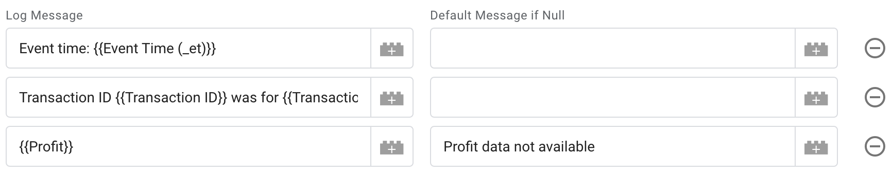
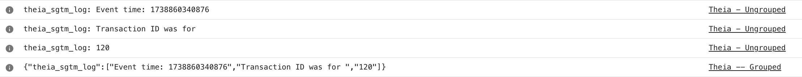
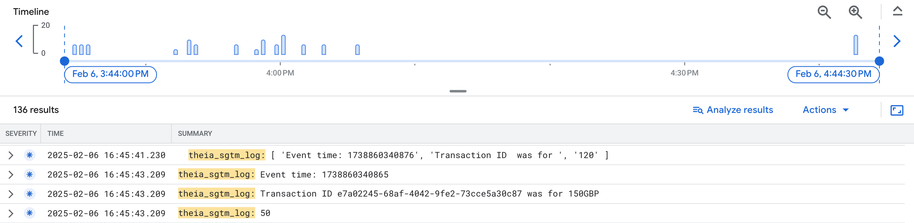
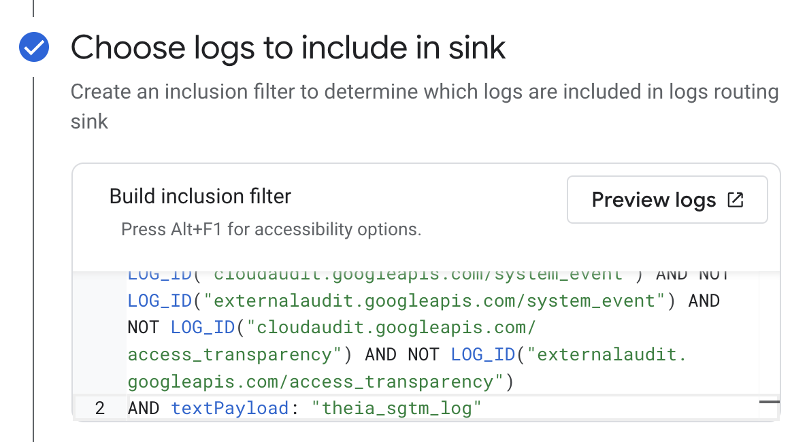

# Theia

Theia allows you to easily log to preview mode console or Cloud Logging without
needing to write any code. Logs can include the outputs of variables and
transformations in sGTM. It gives you controls to easily keep Cloud Logging
costs down by adding messages to logs which you can easily filter in your
Cloud Logging settings.

## Background
Logging in sGTM requires writing custom tag templates. Theia allows to log
to the preview mode console of Cloud Logging without having to write code.

## Why Argos?

[Theia](https://en.wikipedia.org/wiki/Theia) is is the Greek goddess of sight 
and vision

## Implementation

### Prerequisites

-   Server Side Google Tag Manager
-   Access to Cloud Logging: read/write access to a Cloud Logging

### Tag Set-up

1. Download the [logging_in_preview_mode_and_cloud_logging.tpl](./logging_in_preview_mode_and_cloud_logging.tpl) 
   template to your local machine. Make sure the file is saved with the extension `.tpl`.
2. Open [Google Tag Manager](https://tagmanager.google.com) and select your
   server-side container.
3. Click on templates -> then the new button in the tag templates section. Click the
   three dots in the top right hand corner and import.
4. Select the template from your machine.
5. If you want to log to Cloud Logging as well as preview made go to permissions and 
   ensure that "always log" is selected.
6. Press save.
7. Go to the tags page and press new. Select the Theia tempate you've just uploaded.
8. Configure the tag by adding expected settings.
   a. Log Message Title: Adds a string to the beginning of logs. This is essentially
      when logging to Cloud Logging in order to reduce costs as you will use this as 
      a filter (see below). 
   b. Log grouping: Will split or group logs as selected. If you only add one row
      to the table below it doesn't matter which setting you choose.
   c. Log default if log is null: In the case that a log returns null or empty (e.g.
      if you're logging a variable from sGTM) you can choose to log a default
9. Add things that you want logging as rows in the logs section. In the example below
   three logs have been added which log the event time, details about a transaction
   and some profit data. A default message has been added to the third row because
   it is possible that the profit variable may return blank.
11. Add a triggering condition. We recommend firing on all pages or all events while
    doing testing to make sure you catch all potential errors.
12. Save
13. If logging to Cloud Logging follow the instructions below.

Here you can see the resulting logs in preview mode. It shows what happens if you
choose to group or not group logs:

And here are the results in Google Cloud Logging. The logs were identified by
searching for the log message title which is highlighted in yellow:

### Google Cloud Logging Setup

By default sGTM logs to Cloud Logging unless [logging has been disabled](https://developers.google.com/tag-platform/tag-manager/server-side/cloud-run-setup-guide?provisioning=manual#console-logging). 
Logging must be enabled for this feature to work.

Follow the [console logging instructions](https://developers.google.com/tag-platform/tag-manager/server-side/cloud-run-setup-guide?provisioning=manual#optional_disable_logging)
to filter out the logs coming from the Argos tag using the custom message 
you've set up.

For example, to only include logs which start with the message
"theia_sgtm_log" you would include "AND textPayload: "theia_sgtm_log"":

If you have other logging set-up this filter may be more complex. Use
the preview function when you write the statements to test what logs
are presevered before saving.

Note: logging all events can be very expensive, especially for servers with a 
significant amount of traffic. It is possible to choose to only log specific 
messages by following the instructions linked in the previous paragraph. Use
the Log Message Title that you can configure in the tag settings to add filters
in Cloud Logging.

## Disclaimer

Copyright 2025 Google LLC. This solution, including any related sample code or
data, is made available on an “as is,” “as available,” and “with all faults”
basis, solely for illustrative purposes, and without warranty or representation
of any kind. This solution is experimental, unsupported and provided solely for
your convenience. Your use of it is subject to your agreements with Google, as
applicable, and may constitute a beta feature as defined under those agreements.
To the extent that you make any data available to Google in connection with your
use of the solution, you represent and warrant that you have all necessary and
appropriate rights, consents and permissions to permit Google to use and process
that data. By using any portion of this solution, you acknowledge, assume and
accept all risks, known and unknown, associated with its usage, including with
respect to your deployment of any portion of this solution in your systems, or
usage in connection with your business, if at all.
