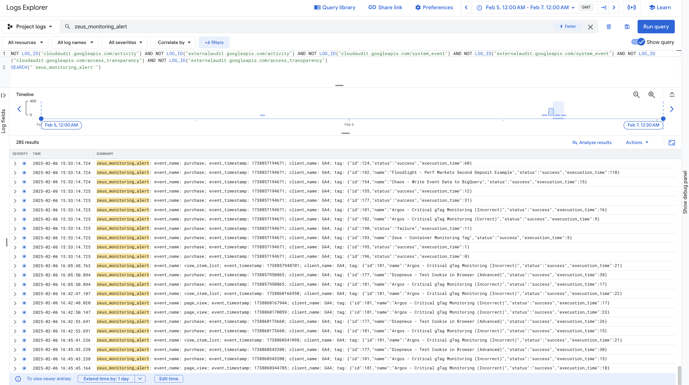
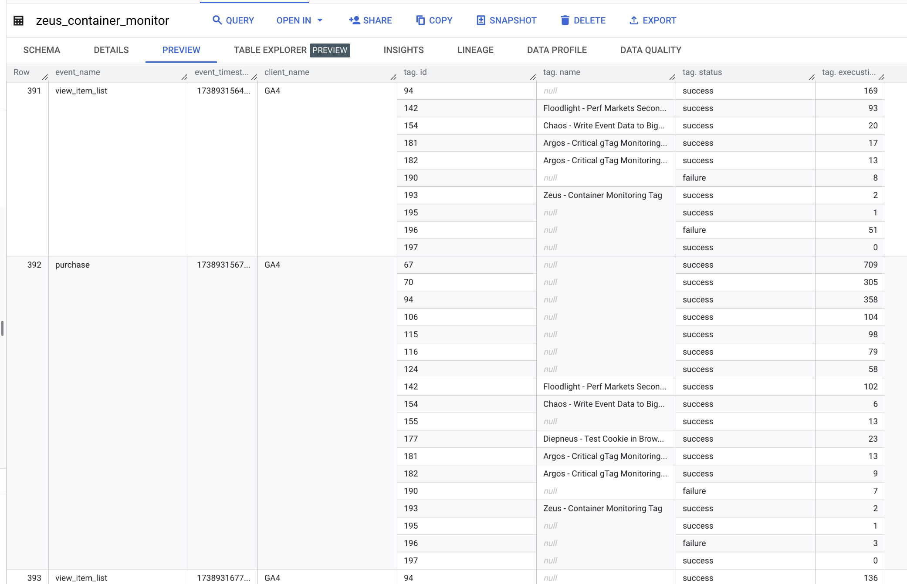
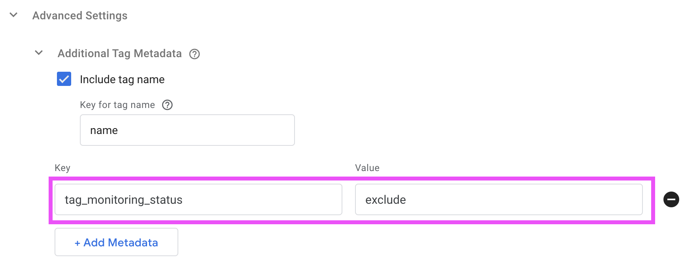
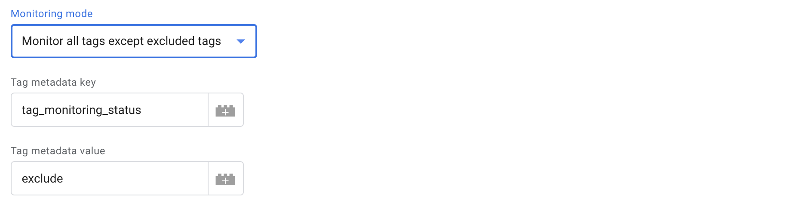
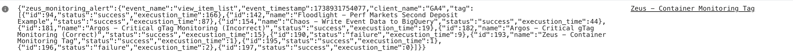
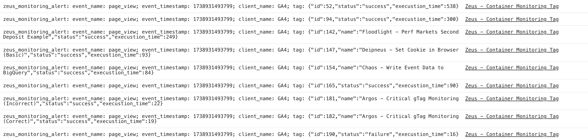
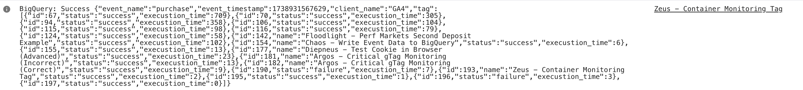
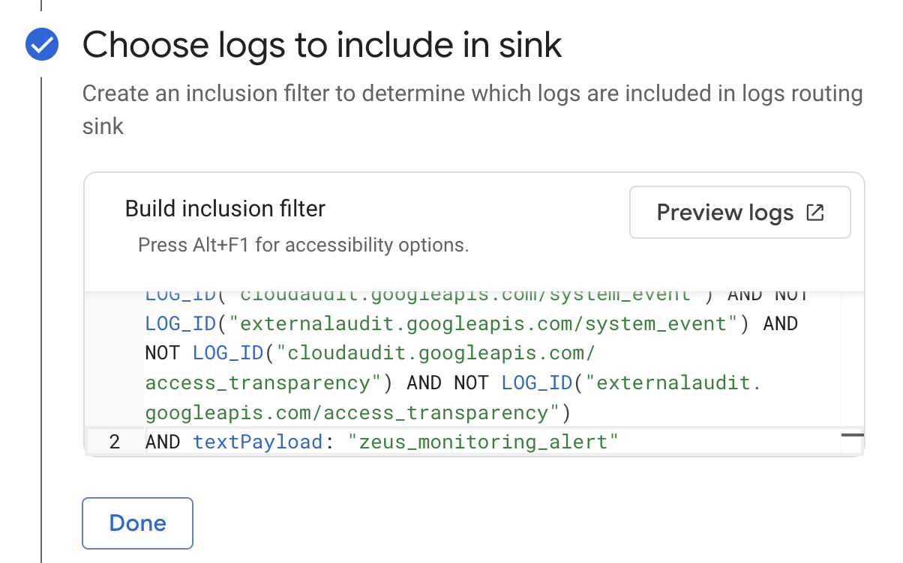
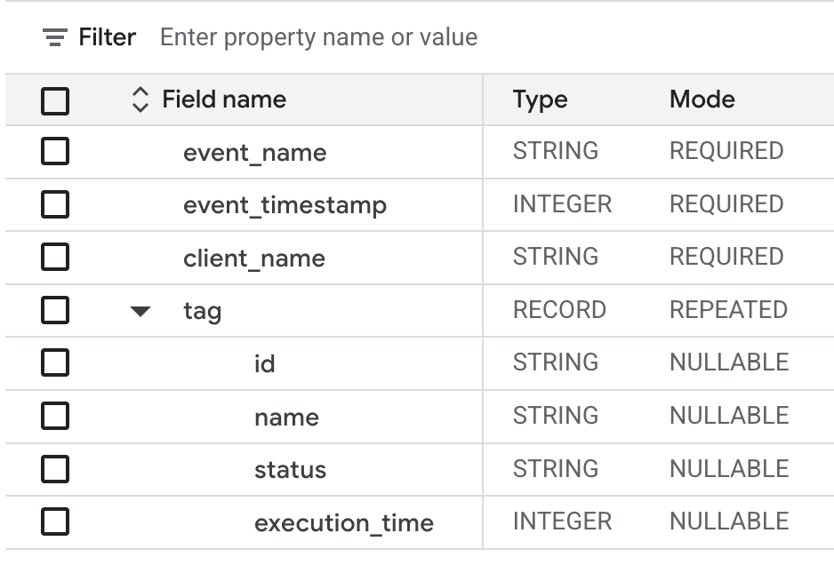

# Zeus

Zeus is a tag that fires after all other tags in an sGTM container have
fired. It is able to monitor the status of tags (i.e. whether they fired
successfully or failed) and then log this to preview mode, Cloud Logging,
and Big Query. It includes settings to make it easy to identify logs and
reduce costs related to logging which can be expensive.

The output of the tag in Cloud Logging may look like this:

And in BigQuery the output looks like this:

## Background
It is hard to monitor sGTM containers because they are stateless. If tags
break or even the container goes down it can often take a while to notice.
Zues allows you send logs to Cloud Logging and BigQuery. You can then use
this data to create alerts and dashboards.

## Why Zeus?

[Zeus](https://en.wikipedia.org/wiki/Zeus) is is the Greek god of the 
clouds. This tag logs to Google Cloud Logging

## Implementation

### Prerequisites

-   Server Side Google Tag Manager
-   Access to Cloud Logging: read/write
-   Access to BigQuery: read/write 

### Tag Set-up

1. Download the [container_monitoring_tag.tpl](./container_monitoring_tag.tpl) 
   template to your local machine. Make sure the file is saved with the extension `.tpl`.
2. Open [Google Tag Manager](https://tagmanager.google.com) and select your
   server-side container.
3. Click on templates -> then the new button in the tag templates section. Click the
   three dots in the top right hand corner and import.
4. Select the template from your machine.
5. If you want to log to Cloud Logging as well as preview made go to permissions and 
   ensure that "always log" is selected.
6. Press save.
7. Go to the tags page and press new. Select the Zues tempate you've just uploaded.
8. Configue the tag:
- a. Monitoring mode & tag metadata: You can choose to monitor all tags, only included tags, or all
tags except excluded tags. If you choose either of the second two options you will
see two boxes appear which allow you control which tags are included/excluded. This
is acheived by adding metadata to other tags in the container which Zues reads. In the
other tags you will need to go to advanced settings and add a piece of metadata. The
example below shows how you might exclude tags from being monitored by adding a piece
of metadata with the key "tag_monitoring_status" and the value "exclude":

In Zues you would select the exclusion monitoring mode, and set Tag metadata key
 to "tag_monitoring_status" and Tag metadata value to "exclude" as shown below:

 

For inclusion you may choose "tag_monitoring_status" and the value "inclusion". 

- b. Log grouping: choose if you want to log once per event or once per tag. If 
you choose the latter and have lots of tags you may produce many logs. Here
is ane example of grouped logs:

 

And here is an example of ungrouped logs:

 

- c. Actions: select what actions you'd like to tag to take. You will see 
additional fields appear depending on your selection.
- d. Cloud Logging Custom Message: Allows you to add a message to the beginning
of each log. This is important to help with reducing costs. You can use this 
message to create filters in cloud logging to only include logs that have this
message at the beginning. Make sure it is something unique. You can use variables
but it is not recommended. See Cloud Logging set-up below for further instructions.
In the example above zues_monitoring_alert appears at the beginning of logs sent
to Cloud Loggiing
- e. BigQuery: add details of of the dataset that the tag will log data to. Follow
the instructions below to create this table. As API calls to BigQuery may fail
choose whether you'd like to log successes and errors to preview mode. You can also
choose to cause the Zues tag to fail if the BigQuery insertion fails. Here is an 
example of a successful BigQuery call logged in preview mode:

9. Add a triggering condition. We recommend firing on all pages or all events while
    doing testing to make sure you catch all potential errors.
10. Save
11. If logging to Cloud Logging follow the instructions below.

### Tag Set-up

As mentioned above, for Zues to work correctly you will need to ensure that you
set up the tag name and metadata settings corretly in all the other tags in your
container. 

In order to log the tag name tick "Include tag name" and set "Key for tag name" 
to "name". If you want to update the key you could update the code in the template
replacing "tag.name" with a different key.

### Google Cloud Logging Setup

By default sGTM logs to Cloud Logging unless [logging has been disabled](https://developers.google.com/tag-platform/tag-manager/server-side/cloud-run-setup-guide?provisioning=manual#console-logging). 
Logging must be enabled for this feature to work.

Follow the [console logging instructions](https://developers.google.com/tag-platform/tag-manager/server-side/cloud-run-setup-guide?provisioning=manual#optional_disable_logging)
to filter out the logs coming from the Argos tag using the custom message 
you've set up.

For example, to only include logs which start with the message
"theia_sgtm_log" you would include "AND textPayload: "zeus_monitoring_alert"":

If you have other logging set-up this filter may be more complex. Use
the preview function when you write the statements to test what logs
are presevered before saving.

Note: logging all events can be very expensive, especially for servers with a 
significant amount of traffic. It is possible to choose to only log specific 
messages by following the instructions linked in the previous paragraph. Use
the Log Message Title that you can configure in the tag settings to add filters
in Cloud Logging.

### BigQuery Setup

If the server-side container is deployed to App Engine or Cloud Run, then Google 
Tag Manager will use the service account attached to the instance for connecting 
to BigQuery.

If the server-side container is deployed in a different Cloud provider to Google 
Cloud, please follow these [additional instructions](https://developers.google.com/tag-platform/tag-manager/server-side/manual-setup-guide#optional_include_google_cloud_credentials) to attach
a Google Cloud service account to the deployment.

This service account needs to have permission to access the BigQuery data.

1. Open the [IAM Service Accounts page](
   https://console.cloud.google.com/iam-admin/serviceaccounts) in the Google
   project that contains the sGTM container and find the account used for the sGTM deployment
   in Cloud Run.
2. Click the pencil to edit the permissions and assign the `BigQuery Data Editor` role ([docs](
   https://cloud.google.com/iam/docs/understanding-roles#bigquery.dataEditor)).
3. Go to [BigQuery](https://pantheon.corp.google.com/bigquery).
4. Within the relevant project create a new dataset, taking note of the name you use.
5. Within the dataset, create a new table again taking note of the name you use.
6. Create a table with the following schema:

7. Save.

## Disclaimer

Copyright 2025 Google LLC. This solution, including any related sample code or
data, is made available on an “as is,” “as available,” and “with all faults”
basis, solely for illustrative purposes, and without warranty or representation
of any kind. This solution is experimental, unsupported and provided solely for
your convenience. Your use of it is subject to your agreements with Google, as
applicable, and may constitute a beta feature as defined under those agreements.
To the extent that you make any data available to Google in connection with your
use of the solution, you represent and warrant that you have all necessary and
appropriate rights, consents and permissions to permit Google to use and process
that data. By using any portion of this solution, you acknowledge, assume and
accept all risks, known and unknown, associated with its usage, including with
respect to your deployment of any portion of this solution in your systems, or
usage in connection with your business, if at all.
